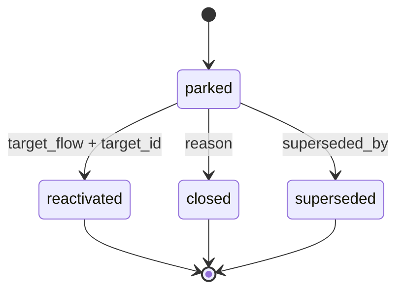

# Backlog 暂缓任务池

- 共享约束 SSOT：[../_shared/constraints.md](../_shared/constraints.md)

> 本 skill 遵循共享约束 SSOT：门控标记、yaml-summary-v1、Task 委托、用户确认、Recovery 格式、只读 / dry-run、FUTURE 三态、realign / spec_version 见 [skills/_shared/constraints.md](../_shared/constraints.md)。本文件只描述 ms-backlog 私有规则。

## 定位

`ms-backlog` 是 DevDocs 的**暂缓任务池**：记录已经有来源编号、暂时不进入当前开发闭环、但未来需要追溯的项。

它只维护 `docs/devdocs/backlog.md` 这一集中索引，不创建新编号体系，不修改原编号文件。条目通过 `source_id + entry_no` 做局部锚点，允许同一来源产生多条暂缓项。

边界：

- 区分于 PO grooming：不做产品排序、价值评审、负责人分配。
- 区分于 Jira / Linear：不维护看板、泳道、Sprint 容量。
- 区分于 `04-dev-tasks.md`：不表示当前已排期任务，只表示暂缓且可追溯。

## 入口与触发词

### CLI 入口

```bash
/ms-backlog --park <source_id>       # 写入 parked 条目
/ms-backlog --reactivate <source_id> # parked → reactivated
/ms-backlog --close <source_id>      # parked → closed
/ms-backlog --supersede <source_id>  # parked → superseded（可选）
/ms-backlog --list[=status]          # 列出条目，默认全部
/ms-backlog --init                   # 初始化 docs/devdocs/backlog.md（使用 templates/backlog-template.md）
```

### 编排入口

`/ms-pipeline backlog` 路由到本 skill，传入：

```yaml
skill: ms-backlog
mode: read | dry-run | apply
inputs:
  command: park | reactivate | close | supersede | list
  source_id: F-01
expected_output: yaml-summary-v1
```

### 触发词

明确管理暂缓项时触发：`暂缓`、`任务暂缓`、`先记下`、`暂时不做`、`回到 backlog`、`backlog 管理`、`backlog entry`、`park`、`reactivate`。

触发词冲突处理：

| 用户意图 | 路由 |
|---|---|
| “这个 P3 先记下 / 暂时不做 / 放 backlog” | `ms-backlog` |
| “列出 backlog / 重新激活 F-01 的暂缓项” | `ms-backlog` |

## backlog.md Schema

`docs/devdocs/backlog.md` 是唯一 SSOT。状态只在该文件维护，原 `F/US/AC/T/INS/BUG/FR/NFR` 文件不加状态字段。

### 文件 frontmatter

```yaml
---
generated_by: ms-backlog
spec_version: backlog.v1
generated_at: 2026-05-19T10:30:00+08:00
updated_at: 2026-05-19T10:30:00+08:00
---
```

### 文件结构

1. `## Index`：按 status 分组，包含 `parked` / `reactivated` / `closed` / `superseded`。
2. `## Entries`：每个条目一个块，标题推荐 `### F-01#1 - <短标题>`。
3. `## Change Log`：可选，记录状态迁移时间、操作者 skill 与原因。

### 条目 frontmatter

每条 backlog 项必须包含 YAML frontmatter 块。

```yaml
source_id: F-01
entry_no: 1
status: parked
created_at: 2026-05-19
created_by_skill: ms-verify
note: "P3 边界 case 待优化"
related_ids: [AC-05, AC-07]
```

必填字段：

| 字段 | 规则 |
|---|---|
| `source_id` | 复用已有编号：`F-XX` / `US-XX` / `AC-XX` / `T-XX` / `INS-XX` / `BUG-XX` / `FR-XX` / `NFR-XX`；禁止 `B-XXX` |
| `entry_no` | 同一 `source_id` 下从 1 开始递增 |
| `status` | `parked` / `reactivated` / `closed` / `superseded` |
| `created_at` | ISO 日期，写入条目创建日 |
| `created_by_skill` | 产生来源 skill，如 `ms-verify` |

状态条件字段：

| status | 必填字段 | 含义 |
|---|---|---|
| `reactivated` | `target_flow` / `target_id` | 已转入目标流程，如 `ms-dev-tasks` + `T-08` |
| `closed` | `reason` | 不再处理的原因 |
| `superseded` | `superseded_by` | 被哪个来源或条目替代 |

可选字段：`note`、`related_ids`、`created_from`、`updated_at`、`updated_by_skill`、`decision_log`。

## 状态机



规则：

- 初始状态只能是 `parked`。
- `reactivated` 表示已消费到目标流程，不等于 done。
- `closed` 表示明确不再处理，必须说明 `reason`。
- `superseded` 是可选终态，用于记录被其他编号或条目取代。
- 禁止 `done` 状态；完成度应由目标流程自身记录。

## 生产侧衔接

其他 skill 产生“暂缓不阻塞”项时，优先通过 `yaml-summary-v1` 向编排层声明，编排层再调用 `ms-backlog --park` 写入。原因：保持来源 skill 单一职责，避免多个 skill 直接改同一 SSOT 造成并发和 schema 漂移。

候选接口：

| 方案 | 行为 | 取舍 |
|---|---|---|
| A 推荐 | 来源 skill 在 `summary.details.backlog_candidates` 输出候选；pipeline 或用户显式调用 `ms-backlog --park` 写入 | 职责清晰、便于 dry-run、避免双写 |
| B 可选 | 来源 skill 直接调用 `ms-backlog --park` 子 Agent | 自动化更强，但需要严格传 allowed paths 与写入锁 |

候选项最小结构：

```yaml
summary:
  details:
    backlog_candidates:
      - source_id: AC-05
        note: "P3 边界 case 待优化"
        created_by_skill: ms-verify
        related_ids: [F-01, AC-07]
```

触发场景：

| 来源 skill | 入池场景 |
|---|---|
| `ms-dev-tasks` | 任务暂缓、依赖未就绪、超出当前迭代但需追踪 |
| `ms-verify` | P3 问题自动入池；P1/P2 不应直接 parked，需按 verify 路由处理 |
| `ms-insights` | 跨任务优化机会，已确认但暂不转为需求 |
| `ms-prd` | FR/NFR 搁置，尚不导入 DevDocs 或等待业务确认 |

## 消费侧转化路径

重新激活时，根据 `source_id` 类型路由：

| source_id | target_flow |
|---|---|
| `F-XX` / `US-XX` / `AC-XX` | `ms-requirements` |
| `T-XX` | `ms-dev-tasks` |
| `INS-XX` | `ms-insights` |
| `BUG-XX` | `ms-bugfix` |
| `FR-XX` / `NFR-XX` | `ms-prd` |

`reactivate` 必须写回 `target_flow` 和 `target_id`。若目标流程尚未生成编号，保持 `parked` 并返回 `partial`，提示先运行目标 skill。

## 门控

⛔ 禁止继续：`--reactivate` 缺少 `target_flow` 或 `target_id`。
恢复方式：先运行目标流程生成目标编号，或由用户明确提供 `target_flow` + `target_id` 后再迁移状态。

⛔ 禁止继续：`--close` 缺少 `reason`。
恢复方式：用户补充关闭原因；未提供前保持 `parked`。

⛔ 禁止继续：尝试创建 `B-XXX` 或其他新编号体系。
恢复方式：改用已有 `source_id`，或先通过对应 skill 生成合法来源编号。

⚠️ 必须确认：同一 `source_id` 已有 active `parked` 条目时再次入池。
恢复方式：用户确认是追加新 `entry_no`，还是更新既有条目；无确认时不写入。

## 追溯能力

- 主锚点：`source_id + entry_no`，例如 `F-01#1`。
- `related_ids` 用于记录辅助关联，不改变主锚点。
- `Change Log` 记录状态迁移，保留 `from_status` / `to_status` / `changed_at` / `changed_by_skill`。

## 不做什么

- 不维护负责人、优先级看板、泳道、Sprint 容量。
- 不替代 Jira / Linear / GitHub Issues。
- 不新增 `B-XXX` 或任何 backlog 专属编号。
- 不修改原 `F/US/AC/T/INS/BUG/FR/NFR` 文件。
- 不把 `reactivated` 解释为完成，也不提供 `done` 状态。
- 不自动改 `ms-pipeline` / `ms-dev-tasks` / `ms-verify` / `ms-insights` / `ms-prd`，仅声明后续集成契约。

## 模板与 Realign

- 初始化模板：[templates/backlog-template.md](templates/backlog-template.md)
- 结构演进：[references/realign.md](references/realign.md)

`backlog.v1` 是当前 spec 起点。修改模板必填章节、字段、状态枚举或硬校验规则时，必须同步更新 [`references/realign.md`](references/realign.md) 的当前版本与 Migration Matrix。

## 子 Agent 摘要格式

**yaml-summary-v1 envelope**：见 [skills/_shared/constraints.md § 2](../_shared/constraints.md#2-yaml-summary-v1-envelope-ssot)

**summary.details 私有字段**：

| 字段 | 值域 / 示例 |
|---|---|
| `mode` | `park` / `reactivate` / `close` / `supersede` / `list` / `init` / `realign` |
| `backlog_path` | `docs/devdocs/backlog.md` |
| `entries_added` / `entries_updated` | 本次新增或更新条目数 |
| `status_counts` | `{parked: 3, reactivated: 1, closed: 2, superseded: 0}` |
| `affected_entries` | `["F-01#1", "AC-05#2"]` |
| `target_flow` / `target_id` | reactivated 时写入目标 |
| `pending_confirmation` | 同源 active parked 冲突等待确认 |

**产物字段**：`output_files` 仅列出 `docs/devdocs/backlog.md`；`new_ids.backlog_entries` 记录局部锚点（如 `F-01#1`），不记录 `B-XXX`。
