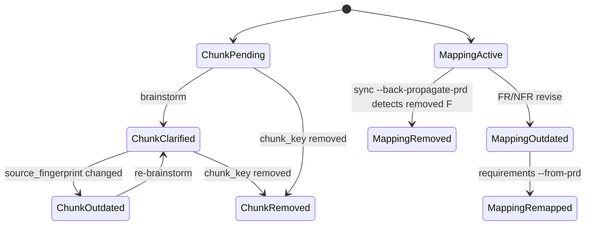

# PRD 修订边界统一规则

> 本 spec 把单条 FR/NFR、chunk、模板三类变更边界收纳到同一张治理表。目标是显性化已有机制，不把 PRD 流程扩展成 keel 6 阶段治理框架。
>
> ℹ️ `docs/prd/` 是单需求一次性脚手架，无跨需求生命周期 / supersede / archive（多需求并行已移除，详见 [prd 单需求脚手架原则](../../SKILL.md#单需求脚手架原则)）。需求收尾清理见 prd `clear`。

## 目标

- 明确三类变更的触发条件、操作边界、下游影响和确认要求。
- 建立 `FR revise -> mapping outdated -> keel 更新` 的显性链路。
- 区分内容修订、原文重解析和模板结构升级，避免用同一种流程处理所有变化。

## 现状证据

| 机制 | 证据 | 状态 |
|---|---|---|
| 单 FR revise | `skills/prd/SKILL.md` --revise 模式：定位 FR，保持 id 不变，原地覆盖，有 keel 映射时置 `mapping_status: outdated` | [现状] |
| PRD 更新与 chunk 指纹 | `skills/prd/SKILL.md` § 编排流程（PRD 更新）、`skills/prd-parser/SKILL.md` § 变更检测：document/source fingerprint 对比后标记 unchanged/outdated/pending/removed | [现状] |
| chunk 状态机 | `skills/prd-parser/SKILL.md` § Status 流转：pending、clarified、outdated、removed 的转换和保持原 chunk ID | [现状] |
| 模板 spec_version | `skills/prd-parser/SKILL.md` § Chunk 文件、`skills/prd-brainstorm/SKILL.md` § 输出文件 要求写入 `generated_by/spec_version/generated_at` | [现状] |
| realign 规则 | `skills/prd-parser/references/realign.md:5-28`、`skills/prd-brainstorm/references/realign.md:5-29`、`skills/pipeline/references/realign.md:65-75` | [现状] |

## 规则

### 三类变更边界

| 变更边界 | 触发条件 | 操作 | 下游影响 | 用户确认 |
|---|---|---|---|---|
| 单条 FR/NFR 内容 | 用户对 `FR-XX` 或 `NFR-XX` 提出修订 | [现状] 原地 revise，保持编号不变；如已有 keel 映射则置 `mapping_status: outdated` | keel 对应 F/FEAT 需要重新导入或人工确认 | ⚠️ 修改需求语义时必须确认；编号不重分配 |
| chunk 原文 | 原始 PRD 文档重传或内容变化 | [现状] document/source fingerprint + chunk_key 匹配；变化标 outdated，新增 pending，删除 removed | 仅 outdated/pending 块重新 brainstorm；removed 需求需标记失效 | ⚠️ 拆分结果需确认；章节删除影响需求时需确认 |
| 模板结构 | FR/chunk 模板必填字段、章节或硬校验规则变化 | [现状] bump `spec_version` 常量并维护 Migration Matrix；realign 补齐结构差距 | 旧产物可能 legacy/drift，需要 additive 补齐或 restructuring 确认 | additive 可直接补齐；restructuring 必须确认 |

### 状态机

## 跨边界传递规则

### FR revise 到 keel

1. [现状] `/prd --revise FR-XX` 保持 `FR-XX` 编号不变并原地覆盖内容（`skills/prd/SKILL.md` § --revise 模式）。
2. [现状] 若该 FR 已映射到 keel，则 mapping 表追加或更新为 `mapping_status: outdated`。
3. [现状] `/requirements --from-prd` 检测 `outdated` 条目后，原地更新对应 F/US/AC，不创建新编号（`skills/requirements/SKILL.md` § --from-prd）。
4. [FUTURE] 自动“keel content drift”报告未单独实现；当前可感知信号是 mapping_status，而非语义 diff 引擎。

### chunk 更新到 FR/NFR

1. [现状] `document_fingerprint` 判断文档是否有变化。
2. [现状] `chunk_key + source_fingerprint` 判断具体块是否变化、删除或新增。
3. [现状] `outdated/pending` 块进入 brainstorm；`removed` 块保留文件但标记状态，不物理删除（`skills/prd-parser/SKILL.md` § 变更追踪约束）。
4. [新增] 若 chunk 变化导致既有 requirement 内容语义变化，`requirements/index.md` 应同步标记对应 FR/NFR 的状态和开放问题。理由：现有流程说明“对应 requirement 标记失效”，但未统一要求写入哪个表格字段。

### 模板升级到产物

1. [现状] `references/realign.md` 顶部记录当前 `spec_version`。
2. [现状] additive 差距可补齐；restructuring 差距必须 AskUserQuestion 逐项确认。
3. [现状] PRD parser/brainstorm realign 不重跑业务流程，不改编号，不重切原文。

## 处理算法

1. 判断输入变化类型：命中单个 `FR-XX/NFR-XX` 时走单条 revise；提供新版原始 PRD 时走 chunk 指纹；修改模板必填结构时走 realign。
2. 读取对应 SSOT：单条 revise 读 requirement 文件和 `requirements/index.md`；chunk 更新读 source/chunks 指纹；模板升级读 `references/realign.md` 当前常量。
3. 执行最小影响操作：单条 revise 保编号；chunk 更新只处理 outdated/pending/removed；realign 只补结构。
4. 写入下游感知信号：mapping outdated、chunk status、PRD status 或 realign-log。
5. 若触发 ⛔ 或 ⚠️ 门控，停止写入业务内容，按门控恢复方式处理。

## 门控

- ⛔ 禁止继续：`--revise` 目标 FR 不存在、FR/NFR revise 试图换编号、parser 改写 chunk 原文、realign restructuring 未经用户确认。恢复方式：检查编号、保持原编号、还原原文或取得确认后再继续。
- ⚠️ 必须确认：章节删除、FR/NFR 语义修订、模板 restructuring。恢复方式：用户确认影响范围和继续策略。
- ℹ️ 建议：maturity 未达 ready、开放问题较多、mapping 已 outdated 但用户暂不进入 keel。恢复方式：记录建议，不阻断 PRD 阶段继续沉淀。

## 验证

- FR revise 验证：修订后 `product_id` 不变；若存在 keel 映射，mapping_status 不再保持 active。
- chunk 验证：outdated 保留原编号，removed 保留文件且不物理删除。
- 模板验证：frontmatter 的 `spec_version` 与对应 `references/realign.md` 当前常量一致。
- [FUTURE] 自动 drift 验证：当前没有独立 PRD content drift runtime；后续若接入，应只报告，不修改业务内容。

## FAQ

### 单条 FR 改动后为什么不重新编号？

现有 `--revise` 明确要求保持 id 和编号不变。重新编号会破坏下游 mapping 和用户引用。

### PRD 文档重传与单 FR revise 怎么选？

只改某个需求语义时用单 FR revise；原始 PRD 文档整体换版或多章节变化时走 PRD 更新和 chunk 指纹重解析。

### 模板 realign 能否顺便修正需求内容？

不能。现有 realign 约束是补齐结构差距，不重新头脑风暴、不重切 PRD、不修改业务内容。

## Related Specs

- [prd-devdocs-mapping.md](./prd-devdocs-mapping.md)
- [prd-mapping-status.md](../prd-mapping-status.md)
- [prd-parser realign](../../../prd-parser/references/realign.md)
- [prd-brainstorm realign](../../../prd-brainstorm/references/realign.md)
- [pipeline realign](../../../pipeline/references/realign.md)

## 可能的失败模式

1. `mapping_status` 只能表达“已知映射过期”，不能证明 keel 内容与 PRD 语义完全一致。
2. chunk 的 `chunk_key` 依赖标题路径，标题大幅改写时可能无法识别同一块，只能进入 pending/removed 组合。
4. 模板 restructuring 的用户确认粒度如果过粗，可能把结构迁移误当成业务需求修改。
