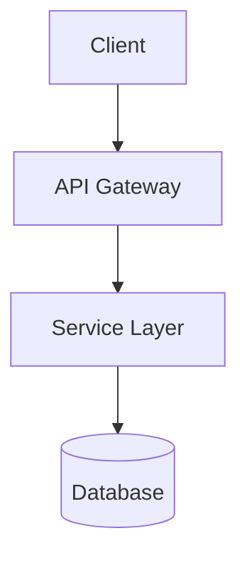
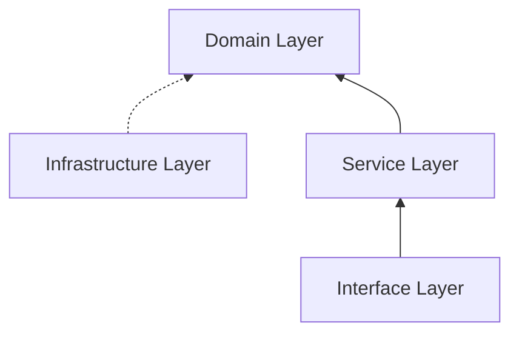

# System Design Document Template

> ℹ️ 模板示例编号使用 v1 前缀（`F-001` / `ADR-001`）；v2 项目 [FUTURE] 应替换为 `FEAT-001`（ADR 不变）。详见 [id-scheme-implementation.md](../../pipeline/references/layout/id-scheme-implementation.md)。

Use this template to generate `docs/devdocs/02-system-design.md`.

> **Frontmatter 必填**：生成文档时必须在正文最顶部插入以下 YAML frontmatter（供 realign 机制识别产物版本），之后才是 `# 系统设计：...` 标题。

```yaml
---
generated_by: ms-system-design
spec_version: design.v1
generated_at: <ISO-8601 timestamp, e.g. 2026-04-23T10:30:00+08:00>
---
```

```markdown
# 系统设计：<功能名称>

## 1. 运行平台

- **目标平台**：<Web/iOS/Android/Desktop/Server/跨平台>
- **最低版本**：<如 iOS 14+, Android 8+, Chrome 90+>
- **部署环境**：<云服务商/私有化/混合>

## 2. 架构概览 <!-- L1: 架构层 -->



### 分层架构 (MTE 模式)




## 3. 技术选型

> 用户偏好：<用户指定的技术栈 / 无偏好>

| 类别 | 选择 | 理由 |
|------|------|------|
| 语言 | <tech> | <why> |
| 框架 | <tech> | <why> |
| 数据库 | <tech> | <why> |
| 缓存 | <tech> | <why> |
| 消息队列 | <tech> | <why> |
| 测试框架 | <tech> | <why> |

> 关键选型请在「设计变更记录（ADR 格式）」节生成对应 ADR 条目。

## 4. 模块设计 <!-- L2: 模块层 -->

> **面向接口原则**：模块间**依赖接口契约**（§5 中定义的 `I*`），不直接耦合到其他模块的实现类或裸模块名。
> "依赖接口引用"列格式为 `接口名(§章节号)`，单模块或无跨模块依赖填"无"。

| 模块 | 状态 | 对外接口引用 | 依赖接口引用 | 职责 |
|------|------|------------|------------|------|
| <name> | 已有/扩展/新增 | `I*(§5.x)` | `I*(§5.x)` 或"无" | <单一职责描述> |

**示例**：

| 模块 | 状态 | 对外接口引用 | 依赖接口引用 | 职责 |
|------|------|------------|------------|------|
| AuthModule | 新增 | `IAuthService(§5.1)` | `IUserRepository(§5.2)`, `IEmailService(§5.3)` | 认证与密码重置 |
| UserModule | 已有 | `IUserService(§5.1)`, `IUserRepository(§5.2)` | 无 | 用户管理 |

### 4.1 <模块名称>

**职责**：<详细描述——确保单一变化原因（SRP）>

**关键组件**：
- 组件 A：<描述>
- 组件 B：<描述>

**可测试性**：
- 核心逻辑无外部依赖
- 外部依赖通过 §5 接口注入（DIP 落地）

## 5. 核心接口 (面向接口设计) <!-- L3: 接口行为层 -->

> **§5 是架构的受控演进层**：接口签名与契约经用户确认后相对稳定；演进必须走增量设计流程（更新契约 + 通知 §4 所有"依赖接口引用"列引用此接口的模块）。
> **实现类不属于 §5**：实现细节在 `/ms-dev-workflow` 阶段产出，设计文档不定义实现类名。
>
> **原则**：定义方法签名和行为契约（前置条件/后置条件/错误契约），**严禁包含任何实现代码或内部逻辑细节**。
> 行为契约使测试可独立于实现编写——Test Agent 仅凭此节即可生成完整测试断言。
>
> **⛔ 本章节完成时必须通过"设计边界自查清单"**（详见 [`../references/design-boundary-guide.md`](../references/design-boundary-guide.md)），未通过不得进入下一层。

### 契约深度标准

| 接口层级 | 前置条件 | 后置条件 | 错误契约 |
|----------|----------|----------|----------|
| 服务层 | **必须** | **必须** | **必须** |
| 数据访问层 | 推荐 | 推荐 | **必须** |
| 外部服务 | 推荐 | 推荐 | **必须**（网络/超时/格式） |

### 5.1 服务层接口

#### IUserService

| 方法 | 参数 | 返回值 | 关联 | 说明 |
|------|------|--------|------|------|
| `createUser` | `CreateUserDTO` | `User` | F-001, AC-001~003 | 创建用户 |
| `getUserById` | `string` | `User \| null` | F-001, AC-004 | 根据ID查询 |
| `updateUser` | `string, UpdateUserDTO` | `User` | F-001, AC-005 | 更新用户信息 |
| `deleteUser` | `string` | `void` | F-001, AC-006 | 删除用户 |

**行为契约：`createUser(dto: CreateUserDTO): User`**

| 类别 | 条件 | 结果 |
|------|------|------|
| 前置条件 | `dto.email` 符合邮箱格式 | — |
| 前置条件 | `dto.password` 长度>=8 且含大写和数字 | — |
| 后置条件 | 返回值包含系统生成的 `id` | `User.id` 非空 |
| 后置条件 | 返回值 `email` 与输入一致 | `User.email === dto.email` |
| 错误契约 | `dto.email` 格式无效 | `ValidationError(EMAIL_INVALID)` |
| 错误契约 | `dto.password` 不满足强度要求 | `ValidationError(PASSWORD_WEAK)` |
| 错误契约 | `dto.email` 已存在 | `ConflictError(EMAIL_DUPLICATE)` |

> 每个方法均需编写行为契约表。错误契约中的异常类型和错误码必须与 Section 11 错误码列表对应。

### 5.2 数据访问接口

#### IUserRepository

| 方法 | 参数 | 返回值 | 说明 |
|------|------|--------|------|
| `save` | `User` | `User` | 保存用户 |
| `findById` | `string` | `User \| null` | 根据ID查询 |
| `findByEmail` | `string` | `User \| null` | 根据邮箱查询 |
| `delete` | `string` | `void` | 删除用户 |

**行为契约：`save(user: User): User`**

| 类别 | 条件 | 结果 |
|------|------|------|
| 错误契约 | 主键冲突 | `DatabaseError(PK_CONFLICT)` |
| 错误契约 | 唯一约束冲突 | `DatabaseError(UNIQUE_VIOLATION)` |

### 5.3 外部服务接口

#### IEmailService

| 方法 | 参数 | 返回值 | 说明 |
|------|------|--------|------|
| `send` | `EmailMessage` | `boolean` | 发送邮件 |

**行为契约：`send(msg: EmailMessage): boolean`**

| 类别 | 条件 | 结果 |
|------|------|------|
| 后置条件 | 发送成功 | 返回 `true` |
| 错误契约 | 网络不可达 | `NetworkError(CONNECTION_FAILED)` |
| 错误契约 | 请求超时 | `NetworkError(TIMEOUT)` |
| 错误契约 | 邮件地址被拒绝 | `ExternalServiceError(RECIPIENT_REJECTED)` |

## 6. 设计模式

> 只在必要时使用，说明解决什么问题

| 模式 | 应用位置 | 解决的问题 |
|------|----------|------------|
| Factory | `UserFactory` | 根据类型创建不同用户对象 |
| Strategy | `PaymentStrategy` | 支持多种支付方式，运行时切换 |
| Repository | `UserRepository` | 数据访问抽象，便于测试和替换存储 |
| Observer | `EventBus` | 模块间解耦，异步事件通知 |

### 模式说明

#### Factory 模式

**问题**：需要根据用户类型创建不同的用户对象
**方案**：使用 Factory 封装创建逻辑

```
UserFactory
├── createNormalUser(dto) -> NormalUser
├── createVipUser(dto) -> VipUser
└── createAdminUser(dto) -> AdminUser
```

#### Strategy 模式

**问题**：支付方式多样，需要运行时切换
**方案**：定义 PaymentStrategy 接口，各支付方式实现该接口

```
IPaymentStrategy
├── AlipayStrategy
├── WechatPayStrategy
└── CreditCardStrategy
```

## 7. 代码落位原则

> 本节仅记录**模块落位到代码的高层约定**，不列出完整目录树。
> 具体目录结构属于团队开发约定，详见 [`../references/code-structure-conventions.md`](../references/code-structure-conventions.md)（如需）。

- **模块落位原则**：每个 §4 模块对应代码仓库的一个子目录或命名空间
- **接口-实现分离**：§5 接口定义与其实现物理隔离（如 `interfaces/` vs `impl/`）
- **命名约束**：<team-specific>（如 camelCase/PascalCase、后缀约定如 `*Service`/`*Repository`）
- **跨模块依赖**：§4 模块依赖图是代码依赖的权威来源，禁止反向依赖

## 8. 数据模型 <!-- L4: 数据模型层 -->

> **L4 归属判定**：本章节仅描述**调用方不可见的持久化细节**（字段类型/长度/索引、实体关系、存储约束）。
> 调用方可观察的业务约束（如"email 必须唯一"）应由 §5 错误契约表达（如 `ConflictError(EMAIL_DUPLICATE)`）。

### 实体汇总

| 实体 | 状态 | 说明 |
|------|------|------|
| <name> | 已有/扩展/新增 | <一句话> |

### 8.1 实体定义

#### User

| 字段 | 类型 | 说明 | 索引 |
|------|------|------|------|
| id | string/uuid | 主键 | PK |
| email | string | 邮箱 | UNIQUE |
| name | string | 用户名 | - |
| status | enum | 状态 | IDX |
| created_at | timestamp | 创建时间 | IDX |
| updated_at | timestamp | 更新时间 | - |

### 8.2 实体关系

```
User 1──* Order
Order *──* Product
```

### 8.3 索引策略

| 表 | 索引名 | 字段 | 类型 | 用途 |
|----|--------|------|------|------|
| user | idx_email | email | UNIQUE | 登录查询 |
| user | idx_status_created | status, created_at | B-tree | 列表查询 |

## 9. API 设计

### 9.1 创建用户

- **方法**：`POST`
- **路径**：`/api/v1/users`
- **描述**：创建新用户
- **认证**：需要

**请求**：
```json
{
  "email": "user@example.com",
  "name": "张三",
  "password": "******"
}
```

**响应（成功）**：
```json
{
  "code": 0,
  "message": "success",
  "data": {
    "id": "usr_xxx",
    "email": "user@example.com",
    "name": "张三",
    "created_at": "2024-01-01T00:00:00Z"
  }
}
```

**响应（错误）**：
```json
{
  "code": 1001,
  "message": "邮箱已存在",
  "details": {
    "field": "email",
    "reason": "duplicate"
  }
}
```

## 10. 状态流转

### 10.1 用户状态

```
┌─────────┐   activate   ┌─────────┐
│ Pending │─────────────>│ Active  │
└─────────┘              └─────────┘
                              │
                              │ suspend
                              v
                         ┌─────────┐
                         │Suspended│
                         └─────────┘
```

| 当前状态 | 事件 | 目标状态 | 副作用 |
|----------|------|----------|--------|
| Pending | activate | Active | 发送欢迎邮件 |
| Active | suspend | Suspended | 记录日志 |

## 11. 异常处理

### 11.1 错误码设计

| 码段 | 类别 | 说明 |
|------|------|------|
| 1000-1999 | 客户端错误 | 参数校验、认证失败 |
| 2000-2999 | 业务错误 | 业务规则校验失败 |
| 3000-3999 | 系统错误 | 内部错误 |

### 11.2 错误码列表

| 错误码 | 消息 | 说明 | 处理策略 |
|--------|------|------|----------|
| 1001 | 参数无效 | 字段验证失败 | 返回字段详情 |
| 1002 | 未授权 | Token无效/过期 | 跳转登录 |
| 2001 | 资源不存在 | 实体不存在 | 返回 404 |
| 3001 | 内部错误 | 未预期错误 | 记录日志告警 |

## 12. 扩展性设计

### 12.1 当前设计限制

- 最大并发用户：<数量>
- 最大 QPS：<数量>
- 数据保留期：<周期>

### 12.2 扩展点

| 扩展点 | 当前实现 | 扩展方式 |
|--------|----------|----------|
| 支付方式 | 支付宝 | 实现 IPaymentStrategy |
| 通知渠道 | 邮件 | 实现 INotificationChannel |
| 存储方式 | MySQL | 实现 IUserRepository |

### 12.3 不做的设计

> 以下需求当前不考虑，避免过度设计

- [ ] 多租户支持（当前单租户）
- [ ] 国际化（当前中文）
- [ ] 分库分表（当前单库）

## 13. 需求追溯

> 确保每个功能点都有对应的设计实现

| 功能点 | 用户故事 | 实现模块 | 核心接口 | 数据实体 |
|--------|----------|----------|----------|----------|
| F-001 | US-001 | UserModule | IUserService.createUser | User |
| F-001 | US-002 | UserModule | IUserService.validatePassword | User |
| F-002 | US-003 | AuthModule | IAuthService.login | Session |

### 覆盖检查

- [ ] 所有功能点 (F-XXX) 都有对应模块
- [ ] 所有验收标准 (AC-XXX) 都有对应接口方法
- [ ] 无遗漏的功能点
```

## MTE 原则检查清单

设计完成后，检查是否满足 MTE 原则：

### Maintainability（可维护性）
- [ ] 每个模块职责单一（SRP）
- [ ] 依赖关系清晰，无循环依赖；依赖层级 ≤2（LoD）
- [ ] §4 模块通过 §5 接口通信，未直接耦合到实现（DIP）

### Testability（可测试性）
- [ ] 核心业务逻辑无外部依赖
- [ ] 外部依赖通过接口注入
- [ ] 可独立进行单元测试
- [ ] 核心接口包含完整行为契约（前置/后置/错误），测试可独立于实现编写

### Extensibility（可扩展性）
- [ ] 预留了合理的扩展点
- [ ] 使用接口抽象，符合开闭原则
- [ ] 没有为假设需求过度设计

## 设计审查

> 由对抗性设计审查生成。

| 视角 | 挑战问题 | 回应 | 结论 |
|------|---------|------|------|
| 产品 | | | 接受/驳回 |
| 工程 | | | 接受/驳回 |
| 测试 | | | 接受/驳回 |

## 设计变更记录（ADR 格式）

> ⚠️ **ADR 仅记录决策理由（WHY）**：为什么选 A 不选 B、权衡了什么。
> 具体改了哪里（WHAT）由正文章节的 diff 体现，不重复写进 ADR。
> **追加 ADR 不等于完成修订**——正文相关章节必须同步更新（见 `references/incremental-design.md` 检查清单）。

对每个关键架构决策，使用结构化 ADR 记录（初始设计记录关键选型，增量设计记录变更的决策理由）：

```markdown
### ADR-001: 选择 PostgreSQL 作为主数据库

- **状态**：已采纳
- **背景**：项目需要支持复杂查询和事务处理
- **决策**：选择 PostgreSQL 作为主数据库
- **替代方案**：MySQL（社区版不支持部分窗口函数）、MongoDB（不适合强关系数据）
- **下游影响**：需要额外配置连接池，团队需了解 PG 特性（影响描述，非变更清单）
- **关联**：F-001, F-002

### ADR-002: 采用分层架构替代微服务

- **状态**：已采纳
- **背景**：Solo 开发，微服务运维成本过高
- **决策**：使用分层单体架构（接口→服务→领域→基础设施）
- **替代方案**：微服务（运维复杂度高）
- **下游影响**：部署简单，但需注意模块边界保持清晰
- **关联**：v1 用 `INS-001` / v2 [FUTURE] 用 `ADR-001` 或 `PATTERN-001` 或 `NOTE-001`（按 ms-insights AskUserQuestion 归类）
```

> ADR 编号在项目内全局递增，不重复。状态可选：`已采纳` | `已废弃` | `已取代`。
> 若某原则被显式违反（见 `references/solid-principles-guide.md` 原则校验表 ⚠️），必须在此节生成对应 ADR 说明"为何违反"。

## Split File Guidelines

When document exceeds 300 lines, split as follows:

### 02-system-design.md (Main)
- Sections 1-7: Platform, Architecture, Tech Stack, Module, Interfaces, Patterns, Structure

### 02-system-design-api.md
- Section 9: Complete API Design
- Section 10: State Flow

### 02-system-design-data.md
- Section 8: Data Model
- Section 11: Error Handling
- Section 12: Extensibility
